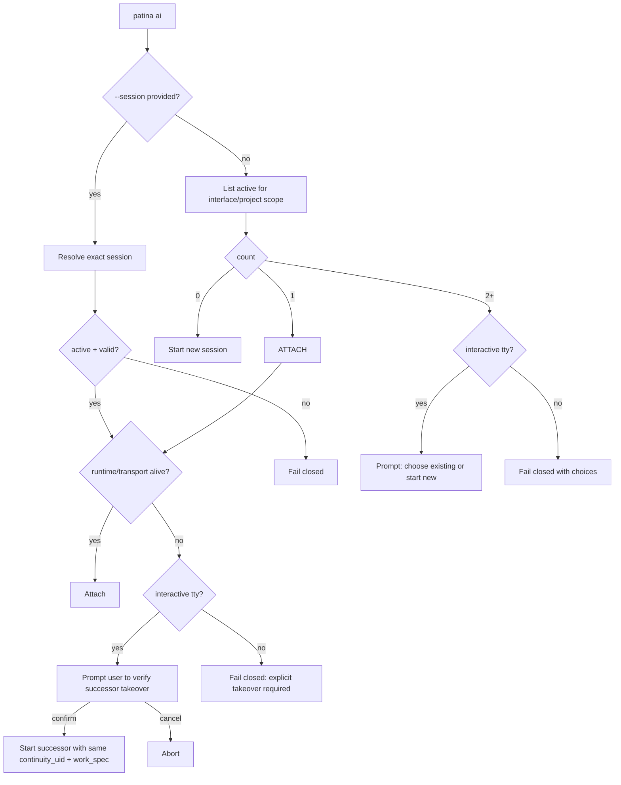

# Design: refactor: Interface Session Artifacts

## Why This Design

We need one durable session model that still respects interface differences.

- A session must be a contained durable object.
- Interfaces capture sessions differently; this slice actively targets Claude and PI.
- We should not force users into new flags or changed everyday behavior.

## Build Target

1. Keep `patina ai <interface>` ergonomics stable.
2. Make attach/start behavior deterministic (0/1/many contract).
3. Require interface-owned session artifacts.
4. Keep Claude user flow + skill design unchanged.
5. Design PI capture ground-up for Patina session/tmux infrastructure.
6. Enforce near-identical Claude↔PI artifact structure.
7. Bind sessions to spec work via `work_spec` + stable `continuity_uid`.
8. Support user-verified successor takeover when a prior session dies.
9. Keep OpenCode deferred and Gemini paused in this refactor scope.

## Resolved Decisions

- Claude capture stays summary-first with existing skills/UX.
- PI capture is machine-distill-first from JSONL logs.
- Canonical markdown frame is locked for ingestion; content source can differ.
- Sessions are spec-bound and continuity-bound (`work_spec`, `continuity_uid`).
- Dead-session replacement requires explicit user verification and lineage metadata.
- This cutover is one-shot in this implementation session; no lingering migration mode.

## Durable Session Object

Session object remains the project durable anchor:

- runtime identity: `runtime_id`, `file_id`
- continuity identity: `continuity_uid`
- explicit work binding: `work_spec`
- status: active/archived
- metadata: interface, voice(optional), timestamps, git tags
- durable record path: `layer/sessions/{file_id}.md`
- references: interface-owned artifact path(s)
- optional successor lineage metadata for takeover events

This separates **session truth** from interface transport mechanics.

## Spec-Bound Continuity & Successor Protocol

Rules:

1. Every session must declare `work_spec` (spec id) and `continuity_uid`.
2. `continuity_uid` persists across restarts and successor sessions.
3. If a prior session is dead/lost, successor creation requires explicit user confirmation in interactive mode.
4. Non-interactive mode fails closed for successor takeover unless an explicit selector path is provided.
5. Successor metadata records lineage and user verification state.

This lets one work thread survive crashes without losing auditability.

## Interface-Owned Artifacts

Each interface must produce its own artifact representation per session.

- artifact format may differ per interface,
- write/update/archive aligned to lifecycle transitions,
- path deterministic from session identity,
- referenced from session object for auditability.

## Interface Capture Pipelines (v1)

### A) Claude — summary-first while working (locked)

Claude is treated as **summary-first** because we cannot depend on a canonical machine transcript artifact for deterministic session distillation.

Lifecycle behavior:

- **start**: create/attach session, read previous artifact context, write non-generic `Previous Session Context` and goals.
- **update**: write substantive delta summary (work done, decisions, failures, constraints, evidence links).
- **note**: append explicit human insight note.
- **end**: force final update then archive.

Lock rule: keep current Claude command/workflow shape and skill prompts unchanged.

### B) PI — machine-distill first (ground-up)

PI uses persisted JSONL logs as primary evidence source and can distill updates automatically.

Lifecycle behavior:

- **start**: bind session identity to PI runtime/log identity.
- **update**: distill new JSONL span into structured facts (messages, tool use, errors), then optionally enrich with narrative summary.
- **note**: append operator note and correlate to nearest log span.
- **end**: distill final span and archive with source-log references.

Rule: machine-distilled facts are primary; LLM enrichment cannot contradict extracted facts.

### C) OpenCode — deferred in this slice

OpenCode remains unchanged while Claude/PI parity is established.

### D) Gemini — paused

Gemini remains unchanged in this refactor; no capture-pipeline migration work is in scope.

## Claude ↔ PI Artifact Parity Contract

Both interfaces must emit near-identical durable session artifacts.

Key distinction:

- **context/content will differ** (Claude active summarization vs PI log distillation),
- **frame is locked** for machine ingestion.

Frame lock requirements:

- same canonical YAML frontmatter schema,
- same core body section layout and order,
- same lifecycle transitions reflected in status/tags.

Canonical YAML frontmatter keys:

- `type`, `id`, `runtime_id`, `continuity_uid`, `work_spec`, `title`, `status`,
- `llm`, `interface`, `created`, `updated`, `start_timestamp`,
- optional `voice`, `participants`, `interfaces`,
- optional lineage fields (`parent_session`, `handoff_from`, `handoff_to`),
- optional takeover fields (`takeover_from_runtime`, `takeover_user_verified`),
- `git` object (`project_uid`, `branch`, `starting_commit`, `start_tag`, optional `end_tag`).

Canonical section headings (exact names, exact order):

1. `## Previous Session Context`
2. `## Goals`
3. `## Activity Log`
4. `## Decisions`
5. `## Evidence`
6. `## Handoff`
7. `## Outcome`

Programmatic ingestion contract:

- parser reads YAML frontmatter as typed metadata,
- parser uses canonical heading anchors to extract body sections,
- interfaces may add detail/subsections under canonical sections only.

## tmux Session-State Infrastructure Contract

Claude and PI share the same tmux/session-state infrastructure semantics:

1. deterministic lane identity derivation,
2. deterministic attach/reattach resolution,
3. consistent teardown on session archive/end,
4. stale pointer/lane reconciliation via shared policy.

## Launch Resolution State Machine



No new primary flags are required for this behavior.

## Liveness and Transport

Lifecycle truth source order:

1. Mother session state (canonical active/archived),
2. interface runtime/socket evidence,
3. tmux lane/process container state.

Transport cleanup must not silently rewrite lifecycle truth.

## Seam Map (Current Code)

- launch and check-in: `src/commands/ai/surface.rs`, `src/interface/internal/checkin.rs`
- ai session subcommands: `src/commands/ai/internal.rs`
- durable session creation/sync/archive: `src/session/internal/live.rs`
- durable artifact render model: `src/session/internal/artifact.rs`
- pointer + file path projection: `src/session/internal/projection.rs`
- resolver fallback logic: `src/commands/session/internal.rs`
- storage truth: `mother/src/state.rs`

## Current vs Target (technical dive lock)

### Current

- durable session artifact + YAML frontmatter model exists,
- Mother session lifecycle is wired,
- Claude summary-first wrapper/skill flow is working,
- many-session ambiguity currently fails closed (no interactive chooser),
- tmux lane identity is interface-scoped,
- PI core log-distill pipeline is not yet implemented,
- end/update flows can append non-canonical top-level headings,
- frontmatter does not yet require `work_spec` + `continuity_uid`,
- successor takeover is not yet explicitly user-verified in structured metadata.

### Target

- Claude unchanged UX/skills + infra alignment,
- PI ground-up machine-distill capture,
- strict canonical artifact frame (frontmatter + heading order),
- required `work_spec` + `continuity_uid` on sessions,
- user-verified successor takeover flow when prior session dies,
- no top-level heading drift outside canonical anchors,
- shared Claude/PI tmux session-state behavior,
- deterministic many-session chooser in interactive mode,
- one-shot cutover delivery (no long-lived migration mode after this session).

## Migration Safety Protocol (short-lived, this session only)

This protocol exists only for the implementation window of this refactor and is removed after cutover verification.

1. Freeze canonical frame during migration (keys + heading anchors/order).
2. Apply parser/validator compatibility before writer mutation.
3. Use temporary PI shadow verification before canonical write cutover.
4. Use crash-safe write strategy (temp + atomic replace).
5. Abort writes on frame validation failure (preserve last-known-good artifact).
6. Keep frequent update checkpoints and small commits around parser/writer changes.
7. Remove temporary migration scaffolding immediately after successful cutover.

## Commits

1. `refactor(session): lock canonical artifact frame + parser validators`
2. `feat(session): add spec-bound continuity metadata (work_spec, continuity_uid)`
3. `feat(pi): implement log-span distill writer for update/end`
4. `refactor(session): successor takeover flow with user verification + lineage metadata`
5. `refactor(interface): chooser UX + tmux/session-target alignment`
6. `chore(session): remove temporary migration scaffolding after one-shot cutover`

## Direct Code Targets

- `src/session/internal/artifact.rs`
- `src/session/internal/live.rs`
- `src/session/mod.rs`
- `src/commands/session/internal.rs`
- `src/interface/internal/checkin.rs`
- `src/interface/internal/launcher.rs`
- `src/commands/ai/surface.rs`
- `src/commands/ai/internal.rs`
- `src/session/internal/projection.rs`
- `mother/src/state.rs`

## Verification Plan

Run:

```bash
cargo check --workspace -q
cargo test --workspace -q session
cargo test --workspace -q ai
cargo test --workspace -q checkin
```

Then execute the scenario matrix below and confirm one-shot cleanup leaves no migration-only toggles active.

## Build Readiness

High. Contract and seams are now explicit, scope is intentionally narrowed (Claude + PI only), and implementation order is locked for same-session cutover delivery.

## Implementation Notes

1. Preserve current Claude command UX and skill prompt design.
2. Keep OpenCode deferred and Gemini untouched (paused scope).
3. Implement frame lock first (required keys + canonical heading order validators).
4. Add required `work_spec` + `continuity_uid` fields to session object/frontmatter.
5. Implement PI log-distill hooks across start/update/end.
6. Normalize computed summaries under canonical sections (remove top-level drift).
7. Add deterministic chooser path when many same-interface sessions exist (TTY chooser, non-TTY fail-closed).
8. Add user-verified successor takeover flow and metadata when prior session dies.
9. Add interface artifact reference/source-span field(s) into session metadata.
10. Enforce Claude↔PI frontmatter/body parity checks.
11. Add parser-contract tests proving DB/ETL ingestion from canonical frame.
12. Harden tmux lane/session-target alignment after resolver behavior is fixed.
13. Remove temporary migration-only paths/toggles in the same delivery session.

## Test Matrix

1. none/one/many launch attach behavior.
2. interactive chooser and non-interactive failure path.
3. Claude summary-first quality tests (substantive context/update/outcome content while working).
4. PI log span distill -> artifact update on start/update/end/archive.
5. required identity-field tests (`work_spec`, `continuity_uid`) on start/attach/successor.
6. successor takeover tests: user-confirmed path writes lineage + verification metadata.
7. Claude↔PI canonical YAML frontmatter parity tests.
8. Claude↔PI core body-section parity tests.
9. no non-canonical top-level headings introduced by update/end pipelines.
10. shared tmux session-state behavior tests for Claude and PI.
11. programmatic-ingest tests: canonical frontmatter parse + canonical heading extraction.
12. no lingering migration shadow/toggle mode after cutover.
13. OpenCode deferred + Gemini paused boundary tests.
14. session object contains interface artifact references.
15. stale pointer/lane recovery does not corrupt durable session state.
